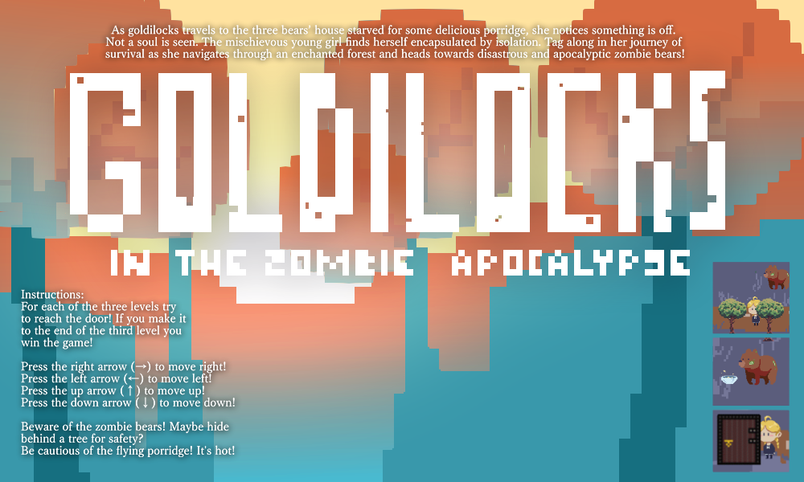

  
  <h3 align="center">Goldilocks in the Zombie Apocalypse</h3>

  A 2D single-player top-down RPG game where you play as Goldilocks in a zombie apocalypse. Built with Java. Try your best to avoid the zombie bears and flying porridge and safely make it to the Bears' house! 
  Designed and developed in a team with Shreya Sivakumar and Stephanie Yang.

## Synopsis
As Goldilocks travels to the three bears' house starved for some delicious porridge, she notices something is off: not a soul is seen. The mischievous young girl finds herself encapsulated by isolation. Tag along in her journey of survival as she navigates through an enchanted forest and dodges disastrous and apocalyptic zombie bears!

## Features
- Three levels with increasing difficulty,
- Two types of enemies: zombie bears and flying porridge,
- Depth of field with different z-values for different objects depending on where it is located with respect to the player.

## To Run
1. Download the JAR file in the root folder.
2. Run the JAR file with one of the following methods:
  - Double-click on the JAR file
  - Right-click on the JAR file and select "Open With" -> "Java(TM) Platform SE Binary."
3. Enjoy!

